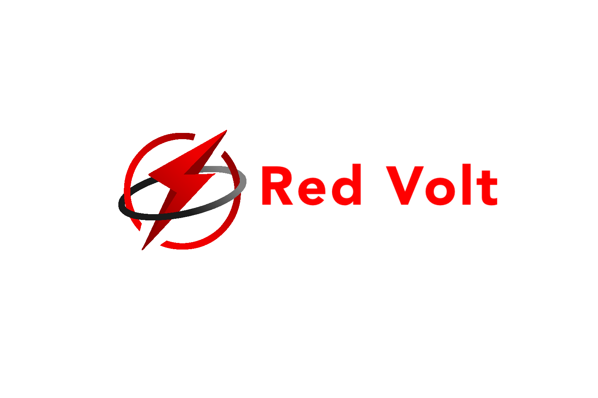

### Fast. Secure. Modern.

  

---

# ⚡ About Red Volt Web Browser

Red Volt Web is a fast, modern, and security - focused browser built using Microsoft Edge WebView2 and Microsoft Visual Studio.

Designed for smooth performance, efficient resource usage, and secure browsing, Red Volt Web combines a clean interface, tracker protection, smart optimization, and responsive browsing for both older and modern Windows systems.

---

# ✨ Features

<table>
<tr>
<td width="50%">

## 🔒 Security
- Suspicious website detection
- Secure browsing
- Tracker blocking
- HTTPS-first support
- Safe download warnings

</td>
<td width="50%">

## ⚡ Performance
- Lightweight design
- Smart tab sleeping
- Reduced background usage
- Smooth performance
- Optimized resource usage

</td>
</tr>

---

# 🧠 Why Red Volt Web?

✔ Clean and modern UI  
✔ Fast startup speed  
✔ Efficient memory usage  
✔ Responsive browsing experience  
✔ Security-focused design  
✔ Built for Windows systems  

---

# 🚀 Built With

---

# 📂 Project Structure

text id="8b0h0q" RedVoltWeb/ ├── assets/ ├── browser/ ├── ui/ ├── security/ ├── downloads/ ├── tabs/ ├── settings/ └── README.md 

---

# ❤️ Red Volt Web

### Fast. Secure. Efficient.

